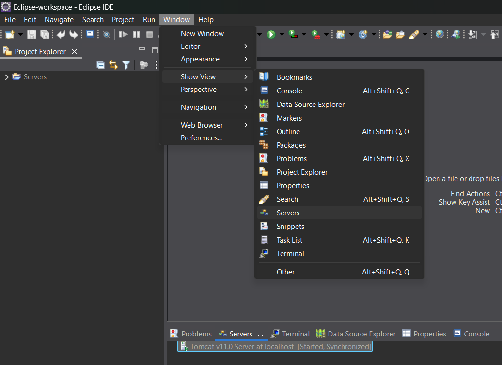

## Risorse utilizzate:

- [Eclipse IDE](https://eclipseide.org/)
- [Visual Studio Code](https://code.visualstudio.com/)
- [MySQL Community Edition](https://www.mysql.com/products/community/)
- [Flowchart](https://www.lucidchart.com/pages)

---

# Creazione database

Perfetto per prima cosa bisogna creare un database ed in questo caso utilizzeremo MySQL, creando un database chiamato "gestionaledipendenti" e successivamente creando una tabella che in futuro posso andare a cambiare e modificare.

Ho scelto alcuni valori unique poichè dati come codice fiscale ed email sono univoci e non esistono duplicati nella vita reale.

In futuro potremmo implementare funzioni e stored procedures.

```sql
create table dipendenti (
	id int not null auto_increment primary key,
    nome varChar(50) not null,
    cognome varChar(50) not null,
    codice_fiscale varChar(16) not null unique,
    data_nascita date not null,
    luogo_nascita varChar(50) not null,
    email varChar(100) not null unique,
    telefono int not null unique,
    indirizzo varChar(200) not null,
    data_assunzione date not null,
    ruolo varChar(75) not null,
    reparto varChar(75) not null,
    stipendio int not null,
    attivo boolean not null
);

```

# Creazione server Tomcat

Una volta su eclipse dobbiamo entrare nella prospettiva di Java EE (Java Enterprise Edition, serve per creare applicazioni più robuste per web services)



Se non dovremmo avere questa prospettiva possiamo aprirla di qui
